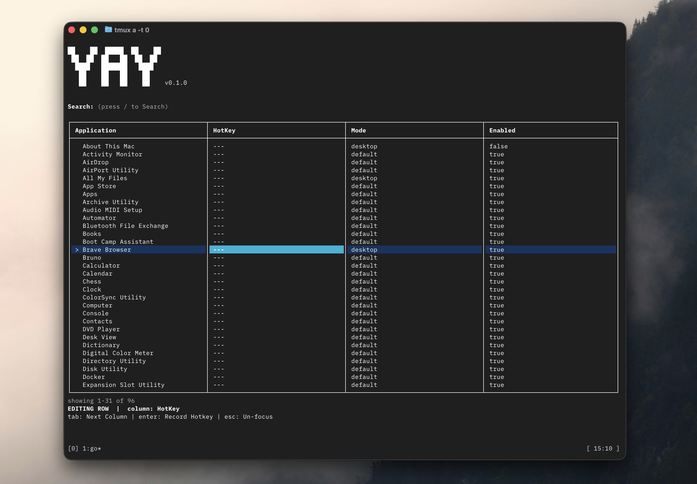

## Arguments

```sh
# Open TUI interface
yay
```

```sh
# Start background daemon
yay start
```

```sh
# Stop background daemon
yay stop
```

```sh
# Display latest version
yay version
```

```sh
# Display help message
yay help
```
