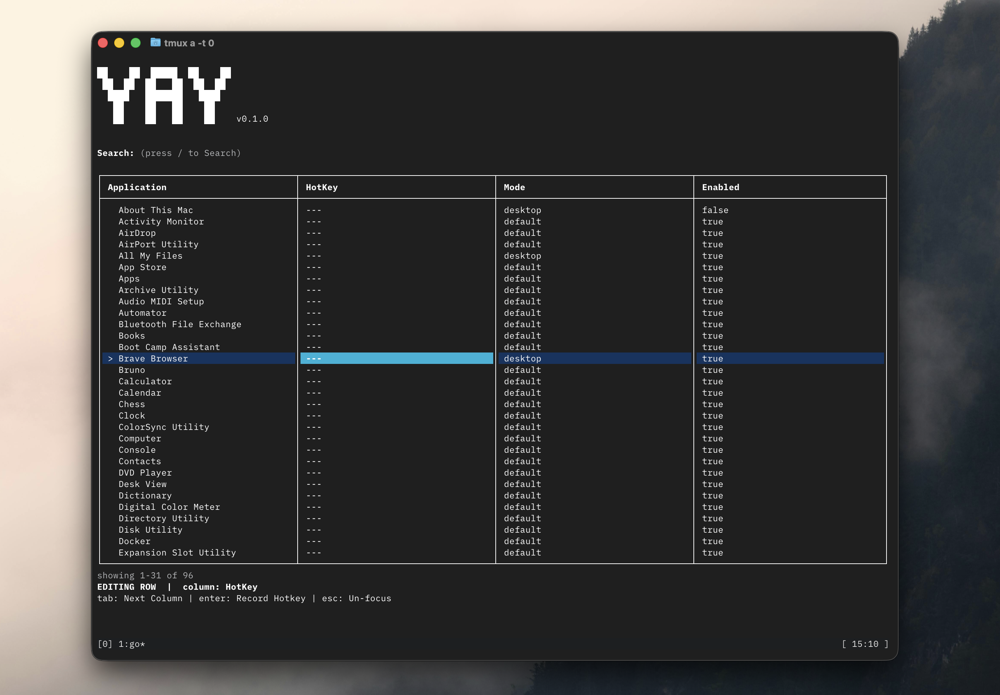

> [!NOTE]
>  Only supports MacOS (Apple Silicon) for now, other platforms and operating systems planned for the future.

## Arguments

```sh
# Open TUI interface
yay
```

```sh
# Run application
yay run
```

```sh
# Start background service
yay start
```

```sh
# Check background service status
yay status
```

```sh
# Stop background service
yay stop
```

```sh
# Display current version
yay version
```

```sh
# Display help message
yay help
```

##

> [!NOTE]
>  To enable switching between spaces on **Mac Os** enable the "When switching to an application, switch to a Space with open windows for the application" option in **System Settings** > **Desktop & Dock** > **Mission Control**.
